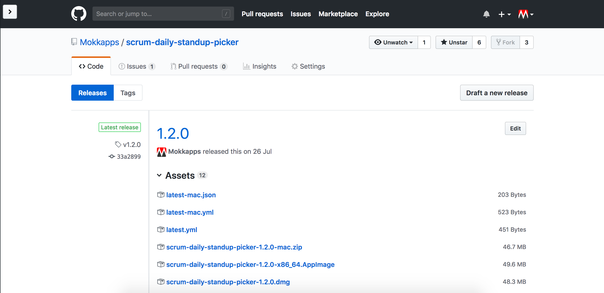

Last year I developed the [Standup Picker](/standup-picker) which is an [Angular](https://angular.io) application running in an [Electron](https://electronjs.org) shell.

As I released new versions while older versions were already in use, I wanted to gain more confidence while releasing newer versions of my application.

As the [source code is available at GitHub](https://github.com/Mokkapps/scrum-daily-standup-picker) I researched for free alternatives to [Jenkins](https://jenkins-ci.org/) which we used at work for Continuous Integration (CI).

I found [Travis](https://travis-ci.org) which is a free continuous integration platform for GitHub projects.

## My Expectations


I wanted to integrate automated E2E and unit tests before each release of the Electron application. In my case, a release should be triggered if something has been merged to master. So the CI should basically perform these steps:

1. Run unit tests
2. Run E2E tests
3. Create Electron releases for OS X, Linux, Windows

This way I can be pretty sure that my releases work as expected (at least all the stuff that I have covered by tests).

## Integrate Travis CI in your project

To be able to use Travis you need to make sure that you have a GitHub account and that you have owner permissions for this project hosted on GitHub.

Next step is to visit [the Travis homepage](https://travis-ci.com/), [sign up with GitHub](https://travis-ci.com/signin) and follow the instructions until you can select your project.

To be able to tell Travis CI what automated steps should be executed you need to add a `.travis.yml` file to the root directory of your repository.

Finally, you need to add the `.travis.yml` file to git. If you then commit and push, a Travis CI build is triggered. Be aware that Travis can only run builds on commits which were pushed after the `.travis.yml` file has been pushed to git.

## Configure Travis CI

I will now explain how I configured the `.travis.yml` file for my Electron application.


### Select Operating System

I start with a quote from [the electron-builder website](https://www.electron.build/multi-platform-build) which is an NPM package I used to create my Electron releases:

> Don’t expect that you can build app for all platforms on one platform.

As I wanted to create releases for OS X, Windows, Linux I had to define multiple operating systems. The main reason was that it is not possible to create a Linux release from OS X or Windows.

So I ended up running my Travis setup on Linux and OS X in parallel. My scripts check the current operating system and run
only in the correct environment.

Check the [official documentation](https://docs.travis-ci.com/user/multi-os/) for more details.

These are the relevant parts of my `.travis.yml` file:

```yml
osx_image: xcode8.4 # define OS X image which will be mounted

dist: trusty # use Ubuntu Trusty for Linux operation system

# Note: if you switch to sudo: false, you'll need to launch chrome with --no-sandbox.
# See https://github.com/travis-ci/travis-ci/issues/8836
sudo: required

# Define Node.js as the programming language as we have a web application
language: node_js
node_js: '8'

addons:
  chrome: stable # Install chrome stable on operating systems

# A list of operating systems which are used for tests
os:
  - linux
  - osx
```

## Electron Builder Configurations


For the [electron-builder](https://www.electron.build/) I added some additional cache and variable configuration based on the [official documentation](https://www.electron.build/multi-platform-build):

```yml
env:
  global:
    - ELECTRON_CACHE=$HOME/.cache/electron
    - ELECTRON_BUILDER_CACHE=$HOME/.cache/electron-builder

cache:
  yarn: true
  directories:
    - $HOME/.cache/electron
    - $HOME/.cache/electron-builder
    - $HOME/.npm/_prebuilds

before_cache:
  - if [[ "$TRAVIS_OS_NAME" == "linux" ]]; then rm -rf $HOME/.cache/electron-builder/wine; fi
```

## Define Scripts

Now we define the scripts which should be executed by Travis:

```yml
# These commands are executed before the scripts are executed
install:
  # On OS X we first need to install Yarn via Homebrew
  - if [[ "$TRAVIS_OS_NAME" == "osx" ]]; then brew install yarn; fi
  # Install all dependencies listed in your package.json file
  - yarn

script:
  - echo "Unit Tests"
  - if [[ "$TRAVIS_OS_NAME" == "linux" ]]; then xvfb-run yarn test; else yarn test; fi

  - echo "E2E Tests"
  - if [[ "$TRAVIS_OS_NAME" == "linux" ]]; then xvfb-run yarn test:electron; else yarn test:electron; fi

  - echo "Deploy linux version to GitHub"
  - if [[ "$TRAVIS_BRANCH" == "master" ]] && [[ "$TRAVIS_OS_NAME" == "linux" ]]; then yarn release:linux; fi

  - echo "Deploy windows version to GitHub"
  - if [[ "$TRAVIS_BRANCH" == "master" ]] && [[ "$TRAVIS_OS_NAME" == "osx" ]]; then yarn release:win; fi

  - echo "Deploy mac version to GitHub"
  - if [[ "$TRAVIS_BRANCH" == "master" ]] && [[ "$TRAVIS_OS_NAME" == "osx" ]]; then yarn release:mac; fi
```

### Unit & E2E tests

Electron needs a display driver as it is based on Chromium. You are not able to execute any of your tests (and Electron will fail to launch) if Chromium cannot find a display driver. To fix this issue we need to use a virtual display driver like [Xvfb](https://en.wikipedia.org/wiki/Xvfb).

Xvfb is a virtual framebuffer which enables our tests to run in memory without showing an actual screen.

On Linux, we need to run the NPM test script via `xvfb-run yarn <NPM_SCRIPT_NAME>` on OS X and Windows Chromium is already correctly configured.

### GitHub Release

By running `yarn release:<OS>` from my [package.json](https://github.com/Mokkapps/scrum-daily-standup-picker/blob/master/package.json) via electron-builder I could automatically create a new release draft on the GitHub release page if the unit & E2E tests have passed:



## Conclusion

I really had to invest multiple hours to configure Travis correctly for my application. In the end, the time effort was worth it.

New releases have passed my tests and I can be sure that the basic functionality of the application is working.
