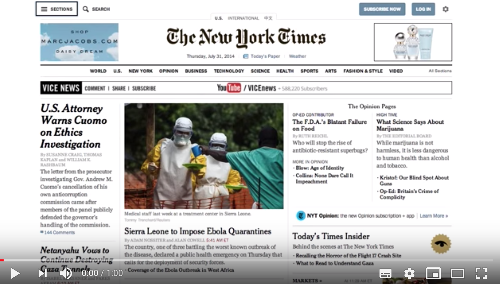
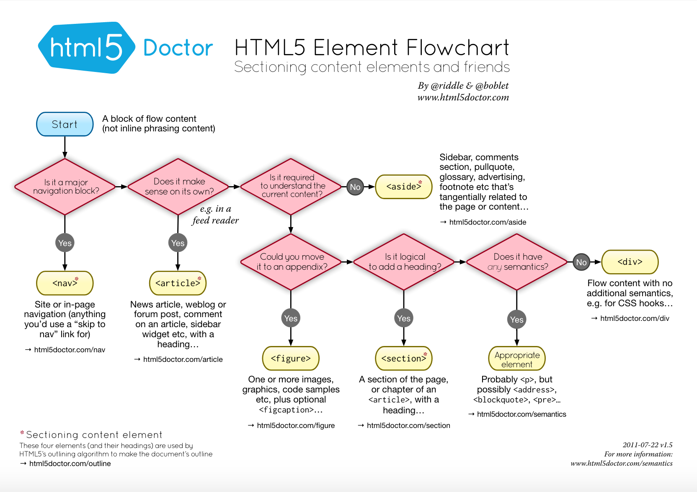

Cover image from <a href="https://www.flickr.com/photos/poakpong/4681315789">Poakpong</a> licensed under <a href="https://creativecommons.org/licenses/by/2.0/">CC 2.0</a></a>

 
 

Back in 2017, when I started frontend development, I heard [an interesting talk](https://isellsoap.github.io/talk-aesthetics-of-the-invisible/#/) with the title "Aesthetics of the invisible" from my former colleague [Francesco Schwarz](https://francescoschwarz.de/). It was all about accessibility in websites and [the corresponding blog post](https://francescoschwarz.de/en/blog/aesthetics-of-the-invisible/) starts with a very good statement:

> Sometimes one single hidden glyph in an HTML markup makes the difference between a good and an outstanding front-end.

As I learned soon, accessibility is a very polarizing topic. These are the typical statements I heard related to this topic:

* "We have no time for accessibility features"
* "There are only a few blind persons, we do not need to support this minority"
* "I hate these [ugly borders](http://www.outlinenone.com/) and I always remove them"
* "We can care about accessibility later if we have more users"

In this blog post, I want to tell you, what accessibility is, why it is important for websites, why I care about it and why you should care about it too. 

# What is Web Accessibility?

If I would need to describe it in my own words I would define it as

> **Anyone** can fully access and interact with a website

The [official Wikipedia article](https://en.wikipedia.org/wiki/Web_accessibility) describes it as

> the inclusive practice of ensuring there are no barriers that prevent interaction with, or access to websites, by people with disabilities.

So a good website should enable access to its content to everybody, even people with disabilities.

By the way, accessibility is often abbreviated by **A11Y**. 

A11Y is what is known as a [numeronym](https://a11yproject.com/posts/a11y-and-other-numeronyms/), which is somewhat similar to an acronym. Unlike an acronym, numbers are used in place of letters to shorten the term. You may already be familiar with other numeronyms, such as “K-9” for “Canine” or “W3C” for “World Wide Web Consortium”.

# What are disabilities?

As I already mentioned in the beginning, there is the misbelief that web accessibility is only relevant for blind users.

According to [a WHO report](http://www.who.int/news-room/fact-sheets/detail/blindness-and-visual-impairment), approximately 1.3 billion people live with some form of vision impairment. Thereof, 36 million people are blind. But also with mild and severe vision impairments, you can have trouble reading content on a website.

Of course, there exist not only visual disabilities. [Google's Accessibility Fundamentals](https://developers.google.com/web/fundamentals/accessibility/) demonstrate some access impairments at real-world examples:

|           | Situational       | Temporary  | Permanent |
|-----------|-------------------|------------|-----------|
| Visual    | distracted driver | concussion | blindness |
| Motor     | holding a baby    | broken arm |           |
| Hearing   | noisy office      |            | deaf      |
| Cognitive |                   | concussion |           |

So all of us could get in a situation where we need to interact with websites but have some kind of situational, temporary or permanent disability.

I like the quote from the article ["Accessibility matters—and here's what we're doing about it"](https://product.voxmedia.com/2016/5/11/11612516/accessibility-matters-and-heres-what-were-doing-about-it):

> **We should never make assumptions about our users**

> Making a product accessible does not mean targeting a specific subset of people. Rather, accessible design, or universal design, is about > > making products usable by the greatest number of people possible. We should not assume we know how our users are engaging with our content, > and should understand that it may be "seen" by a number of assisting technologies, including automated tools, keyboard-only navigation, and > screen readers.

You probably are now thinking: "But **my** customers are different".

Nope, I don't think so!

As you can see in the table above the chances are high that one of your website users has a situational, temporary or permanent disability.

You should care about everyone and not care about a minority.

**Never forget: The website is the front door to your business!**

Of course, you want to have as many people as possible in your business so you should care. So extend them a warm welcome!

# Tools which can assist in browsing a website

I want to introduce you to some tools which can help to browse a website if you have some kind of disability:

* Speech recognition software which allows dictating words and commands to the computer. Helpful for people who cannot use a keyboard or mouse to interact with the computer.
* Subtitled or sign language versions for deaf people.
* Software that enlarges the content of your monitor which can help people with visual impairments.
* Screen reader software which uses synthesized speech to read out elements on the computer display. 

You should definitely try them out to get a feeling for them. I would especially recommend testing screen readers, you can read more about how to use them [here](https://developer.mozilla.org/en-US/docs/Learn/Tools_and_testing/Cross_browser_testing/Accessibility#Screenreaders).

This video shows the usage of a screen reader:

# How can I make a site more accessible?

| User Constraint               |    Accessibility Solution   |
| ---------------               |:-------------------------:|
| Cannot use a mouse or standard keyboard  | Code your page in a way that the navigation also works without a mouse. Therefore it is important to [not remove the outline property](http://www.outlinenone.com/).  |
| Visual impairment             | Use larger texts and images as well as a good color contrast on the page. |
| Blindness                     | For screen readers, having a semantically meaningful HTML (more about that below the table) and textual description of images and links (e.g. using the alt-tag to describe an image: ``) is helpful    |
| Deaf and hard-of-hearing      | Add closed captioned videos or provide a sign language version.  |
| Color blind                   | Underline and color links (or differentiate otherwise) to help color blind users notice them.     |

These are just some of the examples, a good checklist with more information is available at [Web Content Accessibility Guidelines 2.0](http://romeo.elsevier.com/accessibility_checklist/).

In general using `
` as HTML tag should be avoided if possible. Therefore you can always check this amazing graphic from [HTML5 Doctor](http://html5doctor.com/downloads/h5d-sectioning-flowchart.pdf):

I would also advise to use tooling that assists during development like [eslint-plugin-jsx-a11y](https://www.npmjs.com/package/eslint-plugin-jsx-a11y) which is an npm package that provides a static AST checker for accessibility rules on JSX elements. 

# How to test if my website is accessible

I mainly use [Google Lighthouse](https://developers.google.com/web/tools/lighthouse/) to check if my site is accessible.

You can use one of the many accessibility checklists available online but I would recommend using any of the tools described in [Accessibility Testing Tools ](https://css-tricks.com/accessibility-testing-tools/). 

# Is it really so time-consuming to implement accessibility?

Yes, if the project is already in a late stage or you have a legacy code base with massive accessibility issues which you now need to fix. 

No, if you can consider accessibility from the beginning of a project and care about it throughout the development.

# Why an accessible website is a good website

* A well structured semantic HTML website helps to improve your SEO. A search engine bot is, for example, blind, can’t hear, and has the cognitive abilities of a young child. So he is one of your most important website visitor. If he cannot properly access your website, you will get a lower rank in the search requests.
* Nearly everyone can access & interact with your website
* Caring about accessibility is a good attribute of a professional web developer
* An accessible website feels way more professional
* You will save money as you will not need to respond to support questions from users with disabilities.

# Summary
I hope that after this article you now understand why web accessibility is important and why you should care about it. 

It is not about providing support for a minority of people but to provide a good user experience for **every user** of your website. 

Your website is the front door of your business: Let your users know that they are welcome, that you care about them and that your business cares about quality and professionalism.

Hopefully, you are now also a mentor for other developers which still believe that accessibility is not necessary.

# Important Links

* [MDN "What is accessibility?"](https://developer.mozilla.org/en-US/docs/Learn/Accessibility/What_is_accessibility)
* [Google Web Fundamentals Accessibility](https://developers.google.com/web/fundamentals/accessibility/)
* [Why Web Accessibility Is Important and How You Can Accomplish It](https://medium.com/fbdevclagos/why-web-accessibility-is-important-and-how-you-can-accomplish-it-4f59fda7859c)
* [Web Accessibility Checklist](https://a11yproject.com/checklist)
